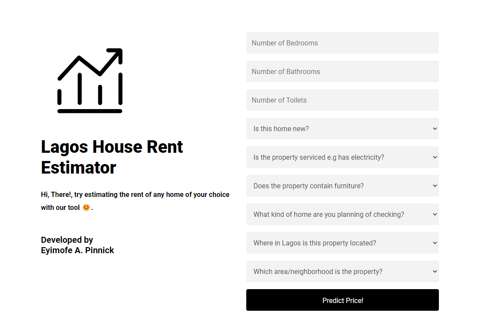

# Lagos Rent Price Estimator : Project Overview

An application that allows users to estimate the price of rent (per year) of a residential property of their choice in Lagos state, Nigeria.

* Used **Beautiful Soup** to web scrap the data from a real estate company's website

* Performed various Data Preprocessing techniques to clean and make the data ready for model building

* Applied **Feature Engineering** to create new features such as the Neighborhood of the  and the type of home is the property e.g. flat, self-contained, duplex

* **Exploratory Data Analysis** was used to discover insights in the data

* Modelled the data with various Machine Learning algorithms with LightGBM performing best

* **Tuned hyperparameters** of the model to achieve best performance.

* LightGBM had an Mean Absolute Error (MAE) score of ₦1.17 million

* Model was deployed on a web application built using **Django** available at [Lagos Estimator](https://lagos-estimator.herokuapp.com/)
___
## Model Performamce

Mean Absolute Error (MAE) was used as the metric as the target data contained many outliers as Lagos state has properties as low as ₦100,00 per year and as high as ₦50 million per year 

| Model    |  MAE (₦ millions)   | 
|-----------|---------|
| Random Forest  | 1.22   |
| XGBoost | 1.18  |
| **LightGBM**   | **1.17**   |

The MAE is comfortable but a bit high as a result of  many outliers in the target variable which are due to Nigeria's failing economy and poor political powerss leading to inflations of many properties. More features could be added to the dataset to achieve higher performance
___
## Model Deployment
The final model with the best score was deployed on a web application built with **Django** with the frontend built with **HTML & CSS** with **Boostrap 4** as the CSS Framework.




___ 
## Data Collection
The data was web scraped from [PropertyPro NG](https://propertypro.ng), a Nigerian real estate website that contains thousands of listings of proporties around Lagos. Selected cities used for this project were Ajah, Gbagada, Ikeja, Ikoyi, Lekki, Ojodu, Surulere, Victoria Island and Yaba.

```BeautifulSoup 4 ``` was used to scrap the data
___
## Data Preprocessing
Feature Engineering was used to extract new features such as:
* The neighborhood the property was located
* The type of duplex is the property e,g Flat, Fully detached duplex, Self-contained
* Location / City of the property e.g Lekki, Ikeja

Data Processing Techniques such as imputation of missing data, scaling of numerical features, encoding of categorical features was applied.
___
## Exploratory Data Analysis
According to analysis, the average (median) price of rent of a residentaial property in Lagos state is around ₦2 million per year.

___
